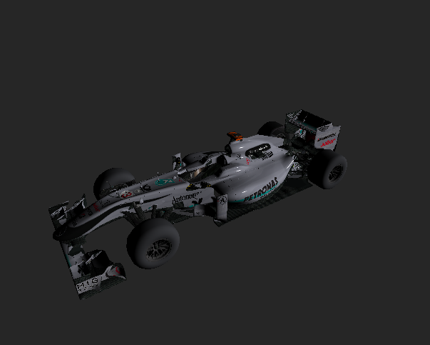

Authors - Mikhail Sorokin and Ruoyu Lei

Programming Assignment 5: Ray-Triangle Intersection Acceleration
----------
#### The following methods are implemented:

1. [Bounding Volume Hierarchy](#bounding)
2. [Surface Area Heuristic - SAH](#sah)
3. [Textures](#textures)
4. [Shadows](#shadows)

# Bounding

# SAH

# Textures

Before texture, the car models didn't have any logos or color visible on it. Afterwards,
the texture image was applied to every pixel on the 

BEFORE:

AFTER:

after_img/Texture_Mercedes.png)

# Shadows

Before texture, one couldn't see the black shadows from objects that are being blocked
by the light. Afterwards, every pixel that was not blocked by another
surface in the scene had a shadow ray created. Here it is in action:

BEFORE:

AFTER:

