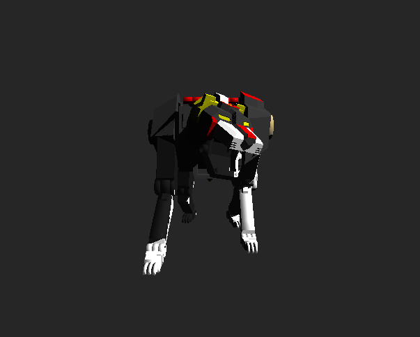
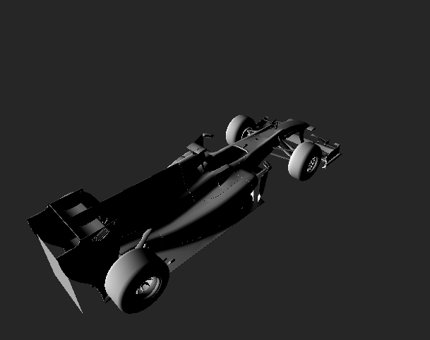
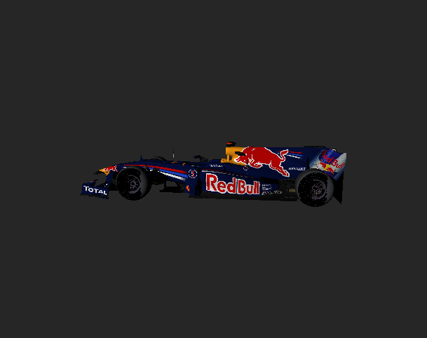
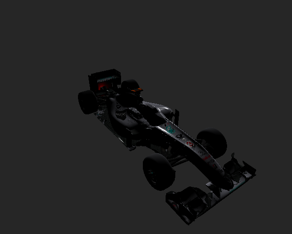
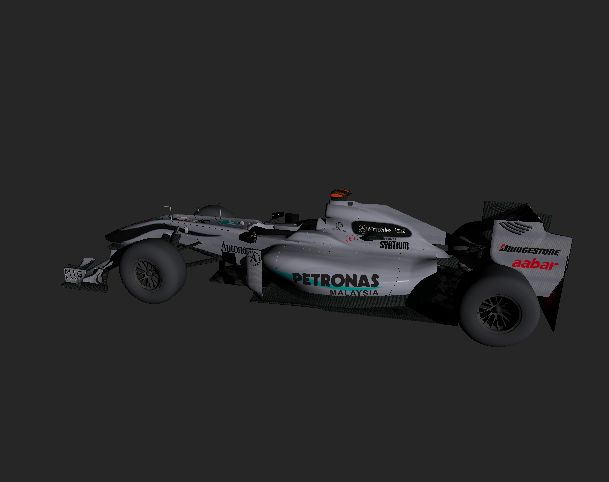

Authors - Mikhail Sorokin and Ruoyu Lei

Programming Assignment 5: Ray-Triangle Intersection Acceleration
----------
#### The following methods are implemented:

1. [Bounding Volume Hierarchy](#bounding)
2. [Surface Area Heuristic - SAH](#sah)
3. [Textures](#textures)
4. [Shadows](#shadows)

# Bounding

After BVH has been implemented, we can measure a significant difference of elapsed time between rendering using BVH verus testing on all Triangles. Take the model lion as an example.

TEST ALL:

BVH:

It took my laptop 54.71 seconds to finish the first "test all" rendering, whereas the BVH in the second pictuer only took 0.02 second to finish.

# SAH

SAH has been implemented, but is restricted to be only applied on a few models. Take the cube as an example.

# Textures

Before texture, the car models didn't have any logos or color visible on it. Afterwards,
the texture image was applied to every pixel on the 

BEFORE:

AFTER:

# Shadows

Before shadows, one couldn't see the black shadows from objects that are being blocked
by the light. Afterwards, every pixel that was not blocked by another
surface in the scene had a shadow ray created. As you can see in the following images, the one before doesn't have any shadows in tire and back of the car. Here it is in action:

BEFORE:

AFTER:

